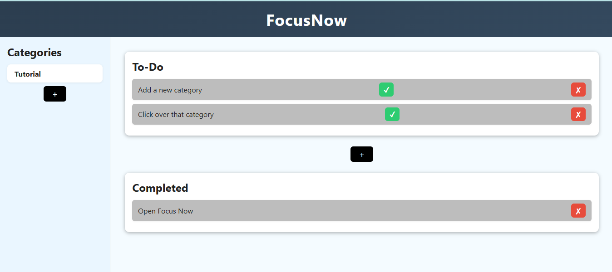

# To-Do List Web App
## Name: FocusNow
## Link: [Live Page]()

A simple and responsive To-Do List appliction built with **HTML, CSS, and JavaScript**.
It allows users to add, mark as complete, and delete tasks with a clean and minimal UI.


## Features
- Add new tasks
- Mark tasks as completed
- Delete tasks
- Add new category
- Switch between categories
- localStorage feature(Your data will be saved in browser)
- Responsive design (works well on desktop and mobile)

## Preview 


## Technologies Used
- HTML
- CSS
- JavaScript **Showing my control over Vanilla JS**

## Installation 
1. Clone this repository:
    ```bash
    git clone https://github.com/Amrit126/FocusNow-ToDoApp.git

2. Open the project folder:
    cd FocsNow-ToDoApp

3. Open index.html in your browser.

## Usage
1. Click the add button in categories and Add new category.
2. Click over that category and start adding tasks.
3. Complete it marks as done or simply remove it.
4. Your task will stay safe in your local browser.

## Author
    Name: Amrit Paudel

